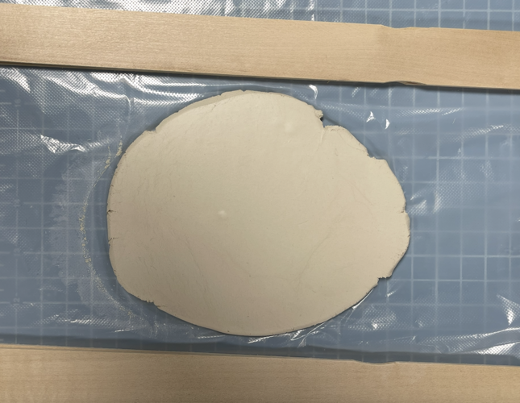
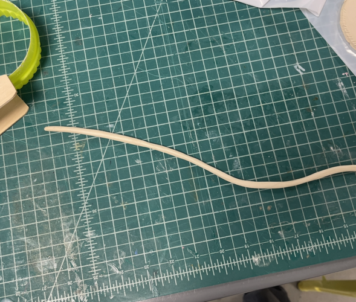
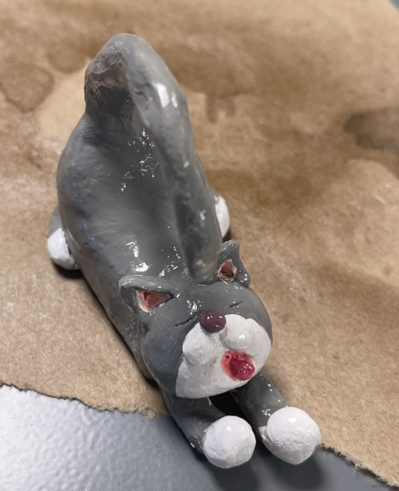

# 🌵 Air-Dry Clay Workshop: Cactus Ring Holder

Welcome to the **Air-Dry Clay Workshop!** Here are the step-by-step instructions to create a **cactus ring holder clay plate** using air-dry clay. Whether you're a beginner or an experienced artist, this guide will help you craft a beautiful and functional piece.

---

## ✨ What You Will Learn
- Basic sculpting techniques
- Shaping, smoothing, and texturing
- Painting and finishing touches
- Creative DIY projects (ring holder, decor, etc.)

---

## 🛠 Materials & Tools
### Essential Supplies:
- **Clay:** Air-dry clay
- **Tools:** Rolling pins (or household alternatives like a soda can), clay tools
- **Coloring:** Acrylic paint, brush sets
- **Extras:** Sandpaper, craving knife, acrylic coating spray, wax paper/silicone mat (for a clean & smooth surface)
- **And the #1 tool:** Your hands!

### 🔄 Tool Alternatives:
You can also use **toothpicks, plastic knives, or other household objects** as substitutes.

### 🛒 Recommended Supplies:
- [Air Dry Clay (5lb)](https://www.amazon.com/gp/product/B089T7PX27/)
- [Pottery & Polymer Clay Tool Set (8Pcs)](https://www.amazon.com/gp/product/B08SWC2PSG/)
- [Cook Classic Wood Rolling Pin (1Pcs)](https://www.amazon.com/gp/product/B000ARPJRM/)
- [Acrylic Paint Set (24 Colors)](https://www.amazon.com/gp/product/B09TWQD5ZL/)
- [Crystal Clear Acrylic Coating Spray (1Pcs)](https://www.amazon.com/gp/product/B00023JE7K/)
- [FolkArt Acrylic Paint (2 Oz)](https://www.amazon.com/gp/product/B003W0FO4C/)

---

## 🏗 Project Instructions

### **Step 1: Make Some Slip**
1. Take a small piece of air-dry clay and place it in a bowl or cup.
2. Add some water (**water-clay ratio = 1:3**) and mix it with a brush or a stick.
3. Set it aside for later use. This slip will act as glue to attach clay pieces together more securely.

---

### **Step 2: Slabbing & Coiling (Creating the Plate Base)**
#### **Slab Method:**
1. Take a chunk of air-dry clay and knead it to soften.
2. **Even slab trick:** Use two stacked wooden pieces on both sides of the air-dry clay.
3. Roll it out into a flat piece (**4-6 inches in diameter, 1/4-inch thick**) using a rolling pin.
4. Use a small bowl or cookie cutter to cut out a circle.
5. Smooth the edges with your fingers using a little slip and water.

  
  

 

#### **Coil Method:**
1. Take a small piece of clay.
2. Roll it out evenly by moving your hands **inwards and outwards**.

---

### **Step 3: Score & Slip**
1. Score both the coil surface and the outer rim of the plate using hatch marks.
2. Apply slip to the hatched areas as glue.
3. Smooth the surface with slip to create a strong bond.

---

### **Step 4: Shape the Cactus Arms**
1. Roll a small piece of clay into a **thick cylinder (2-3 inches tall)** for the cactus trunk.
2. Roll out **two smaller, thinner cylinders** and bend them to mimic cactus arms.
3. Smooth the surface with slip if necessary.

4. Cut the bottom part of the cactus to make a **flat base**, then set it aside to dry.

5. Attach the arm to the trunk using score and slip (see Step 3).

6. Let the cactus dry for a while.

---

### **Step 5: Attach the Cactus to the Plate**
1. Score the middle of the plate and the bottom of the cactus.
   

2. Gently press the cactus onto the center of the plate.
3. Use slip to secure the connection.
4. Blend and smooth the seams where the pieces join.
5. Let it sit for a few minutes to ensure stability.

---

### **Step 6: Let It Dry**
1. Leave the clay piece in a **dry, well-ventilated area** for **24-48 hours**.
2. Avoid **direct sunlight or heat sources** to prevent cracks.
3. When the clay turns **white**, it's ready for the next step.

---

### **Step 7: Sand & Paint**
1. *(Optional)* Sand the edges with sandpaper for a smooth finish.
2. Paint the cactus green with acrylic paint. Add realistic textures or patterns.
3. Paint the plate brown, white, or any color you prefer.
4. Avoid water-activated paint as it may soften the clay.

---

### **Step 8: Seal & Finish**
1. Once the paint is dry, use **crystal sealing spray** to protect it from moisture and dust.
2. Let the sealant dry completely before using your cactus ring holder.

---

## 🎉 Final Touch!
Your **cactus ring holder clay plate** is ready! Now your cactus ring holder clay plate is ready! Place it on your bedside table or vanity and store your rings in a stylish, handmade way. Feel free to customize it by adding tiny clay flowers, or make it into a different plate shape.

🎨 **Enjoy crafting!** 🌵✨

## 💡 More Creative Ideas

Looking for more air-dry clay inspiration? Here are some creative projects to try:

#### Scratching cat

#### Snowman

#### Pencil Cup  [Reference](https://mymodernmet.com/air-dry-clay-ideas/)

#### Earrings  [Reference](https://mymodernmet.com/air-dry-clay-ideas/)

#### More ideas
[Air Dry Clay Project ideas First-timers must try](https://medium.com/@chattkhaoula/air-dry-clay-project-ideas-first-timers-must-try-aef63de2bfe4)

[Air Dry Clay Botanical Tags](https://www.diybeautify.com/2023/04/air-dry-clay-botanical-tags.html)

